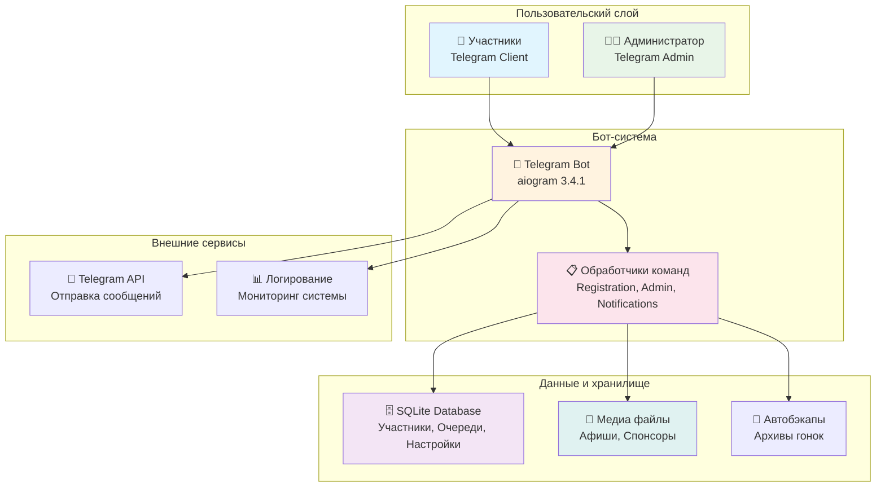

# 🏃‍♂️ Beer Mile Registration Bot

<div align="center">


**Комплексная система управления регистрацией на пивной забег**

*Telegram-бот с полным циклом регистрации, управления участниками и административными функциями*

[🚀 Быстрый старт](#-быстрый-старт) • [📖 Документация](#-документация) • [⚡ Возможности](#-ключевые-возможности) • [🛠️ Установка](#️-установка)

</div>

---

## 🎯 О проекте

**Beer Mile Registration Bot** — это профессиональная система для автоматизации регистрации и управления участниками пивного забега. Система включает **Telegram-бота** для участников и **административную панель** для организаторов с полным набором инструментов управления событиями.

### 🌟 Особенности системы

- **🎪 Event-ready**: Готова к использованию для любых беговых мероприятий
- **👥 Масштабируемость**: Поддержка сотен участников с автоматической очередью ожидания
- **🔧 Гибкость**: Настраиваемые лимиты, категории, кластеры и сообщения
- **📊 Аналитика**: Детальная статистика и экспорт данных в CSV
- **🏆 Результаты**: Система записи и уведомления о результатах гонки
- **📱 Современный UX**: Интуитивный интерфейс с inline-клавиатурами

---

## 🏗️ Архитектура

<div align="center">



</div>

---

## ⚡ Ключевые возможности

### 👥 Для участников
- 🔐 **Простая регистрация** с указанием имени, целевого времени и пола
- 📋 **Очередь ожидания** с автоматическими уведомлениями о доступных местах
- ✏️ **Редактирование профиля** с подтверждением администратором
- 📊 **Статус участия** с информацией о позиции в очереди
- 🎯 **Проверка результатов** после завершения гонки
- 📱 **История участия** в предыдущих мероприятиях

### 👨‍💼 Для администраторов
- 👤 **Управление участниками**: добавление, удаление, изменение статуса
- 💰 **Контроль оплаты**: подтверждение платежей и отслеживание статусов
- 🏃‍♂️ **Беговые номера**: присвоение и управление нумерацией
- 📊 **Аналитика и статистика**: детальные отчеты по участникам
- 📤 **Экспорт данных**: CSV-файлы для внешних систем
- 📮 **Массовые рассылки**: уведомления всем участникам или по группам
- 🎪 **Медиа-управление**: загрузка афиш и изображений спонсоров
- 🔧 **Настройки события**: лимиты участников, даты регистрации
- 🏆 **Результаты гонки**: запись и рассылка результатов
- 📂 **Архивирование**: сохранение данных завершенных мероприятий

### 🎯 Система категорий и кластеров
- **Категории**: Элита, Классика, Женский зачет, Командный
- **Кластеры**: A, B, C, D, E для группировки участников
- **Автоматическая сортировка** в протоколах и списках

### 📊 Аналитические функции
- **Протоколы результатов**: общий, по полу, топ-N участников
- **Статистика регистрации**: оплаченные, ожидающие, в очереди
- **История мероприятий**: данные всех предыдущих гонок
- **Экспорт в CSV** с настраиваемыми разделителями

---

## 🛠️ Технологический стек

<div align="center">

| Категория | Технологии |
|-----------|------------|
| **Backend** |   |
| **Bot Framework** |   |
| **DevOps** |  |
| **Utilities** |   |

</div>

---

## 🚀 Быстрый старт

### Предварительные требования
- 🐳 Docker & Docker Compose
- 🤖 Telegram Bot Token ([создать бота](https://t.me/BotFather))
- 📱 Telegram ID администратора

### 1️⃣ Клонирование и настройка

```bash
# Клонирование репозитория
git clone https://github.com/yourusername/beer-mile-registration.git
cd beer-mile-registration

# Создание файла окружения
cp .env.example .env
```

### 2️⃣ Конфигурация

Отредактируйте файл `.env`:

```env
# 🔑 Обязательные параметры
BOT_TOKEN=your_telegram_bot_token_here
ADMIN_ID=your_telegram_user_id_as_number

# 📊 Настройки мероприятия (опционально)
PARTICIPATION_FEE=750
FEE_CURRENCY=₽
```

### 3️⃣ Запуск

**Через Docker Compose (рекомендуется):**
```bash
# Запуск контейнера
docker-compose up -d

# Проверка статуса
docker-compose ps

# Просмотр логов
docker-compose logs -f bot
```

**Локальная разработка:**
```bash
# Создание виртуального окружения
python -m venv .venv
source .venv/bin/activate  # Windows: .venv\Scripts\activate

# Установка зависимостей
pip install -r requirements.txt

# Запуск бота
python main.py
```

### 4️⃣ Первое использование

1. **Найдите своего бота** в Telegram: `@your_bot_username`
2. **Отправьте** `/start` для активации
3. **Используйте** административные команды для настройки:
   - `/edit_runners 50` — установить лимит участников
   - `/set_reg_end_date` — установить дату окончания регистрации
   - `/info_create` — создать описание мероприятия

---

## 📖 Документация

### Основные команды

#### 👥 Команды для пользователей
| Команда | Описание |
|---------|----------|
| `/start` | Начать регистрацию |
| `/info` | Информация о мероприятии |
| `/edit_profile` | Редактировать профиль |
| `/waitlist_status` | Позиция в очереди ожидания |

#### 👨‍💼 Административные команды
| Команда | Описание |
|---------|----------|
| `/participants` | Список всех участников |
| `/stats` | Статистика регистрации |
| `/pending` | Незавершенные регистрации |
| `/export` | Экспорт данных в CSV |
| `/paid <user_id>` | Подтвердить оплату |
| `/set_bib <user_id> <number>` | Присвоить беговой номер |
| `/remove <user_id>` | Удалить участника |

#### ⚙️ Настройки мероприятия
| Команда | Описание |
|---------|----------|
| `/edit_runners <число>` | Изменить лимит участников |
| `/set_reg_end_date` | Установить дату окончания регистрации |
| `/info_create` | Обновить информацию о мероприятии |
| `/create_afisha` | Загрузить афишу |
| `/update_sponsor` | Загрузить изображение спонсоров |

#### 📮 Уведомления
| Команда | Описание |
|---------|----------|
| `/notify_all` | Отправить стандартное уведомление |
| `/notify_with_text` | Кастомное уведомление с текстом |
| `/notify_unpaid` | Уведомить неоплативших |
| `/notify_all_interacted` | Уведомить всех пользователей бота |

#### 🏆 Результаты и архивы
| Команда | Описание |
|---------|----------|
| `/notify_results <user_id> <время>` | Записать результат |
| `/protocol` | Создать протокол результатов |
| `/archive_race <дата>` | Архивировать мероприятие |
| `/list_archives` | Список архивных мероприятий |

---

## 📁 Структура проекта

```
beermile_reg/
├── 🐍 main.py                        # Точка входа приложения
├── 🗃️ database.py                    # Управление базой данных
├── 🔗 handler_register.py            # Регистрация обработчиков
│
├── 📋 handlers/                      # Обработчики команд
│   ├── simple_registration.py       # Регистрация участников
│   ├── admin_participant_handlers.py # Управление участниками
│   ├── notification_handlers.py     # Система уведомлений
│   ├── profile_edit_handlers.py     # Редактирование профилей
│   ├── waitlist_handlers.py         # Очередь ожидания
│   ├── archive_handlers.py          # Архивирование данных
│   ├── cluster_handlers.py          # Управление категориями/кластерами
│   ├── backup_handlers.py           # Автоматические бэкапы
│   ├── settings_handlers.py         # Настройки мероприятия
│   ├── info_media_handlers.py       # Медиа и информация
│   ├── misc_handlers.py             # Прочие команды
│   ├── utils.py                     # Утилиты и клавиатуры
│   └── validation.py                # Валидация данных
│
├── ⚙️ config.json                    # Конфигурация системы
├── 💬 messages.json                  # Тексты сообщений
├── 📦 requirements.txt               # Python зависимости
│
├── 🐳 docker-compose.yml             # Docker Compose конфигурация
├── 🐳 Dockerfile                     # Docker образ
│
├── 📁 data/                          # База данных SQLite
├── 📁 logs/                          # Файлы логов
├── 📁 images/                        # Медиа файлы
│   ├── afisha.jpeg                  # Афиша мероприятия
│   └── sponsor_image.jpeg           # Изображение спонсоров
│
└── 📄 README.md                      # Документация проекта
```

---

## ⚙️ Конфигурация

### config.json
```json
{
  "csv_delimiter": ";",              // Разделитель для CSV экспорта
  "log_level": "INFO",               // Уровень логирования
  "sponsor_image_path": "/app/images/sponsor_image.jpeg",
  "participation_fee": 750,          // Стоимость участия
  "participation_fee_currency": "₽"  // Валюта
}
```

### Переменные окружения (.env)
```env
# Обязательные
BOT_TOKEN=your_bot_token
ADMIN_ID=admin_telegram_id

# Опциональные
LOG_LEVEL=INFO
DATABASE_PATH=/app/data/race_participants.db
```

### Настройки часовых поясов
- Все операции с датами выполняются в **MSK (UTC+3)**
- Даты в базе данных хранятся в UTC
- Отображение пользователям в московском времени

---

## 🔧 Администрирование

### Мониторинг системы

```bash
# Просмотр статуса контейнера
docker-compose ps

# Мониторинг логов в реальном времени
docker-compose logs -f bot

# Проверка использования ресурсов
docker stats beermile_reg-bot-1
```

### Управление данными

```bash
# Вход в контейнер для прямого доступа к БД
docker-compose exec bot bash

# Просмотр базы данных
sqlite3 /app/data/race_participants.db

# Бэкап базы данных
docker-compose exec bot cp /app/data/race_participants.db /app/data/backup_$(date +%Y%m%d).db
```

### Устранение неисправностей

**Проблемы с правами доступа:**
```bash
sudo chown -R 1000:1000 data/ logs/ images/
chmod -R 755 data/ logs/ images/
```

**Проблемы с HTML-разметкой:**
- Проверьте `messages.json` на корректность HTML-тегов
- Экранируйте символы `<` и `>` как `&lt;` и `&gt;`

**Проблемы с базой данных:**
```bash
# Проверка целостности БД
docker-compose exec bot sqlite3 /app/data/race_participants.db "PRAGMA integrity_check;"
```

---

## 🚀 Производительность и масштабирование

### Характеристики
- **Concurrent Users**: Поддержка 100+ одновременных пользователей
- **Database**: Оптимизированные запросы с индексами
- **Memory Usage**: ~50MB в production
- **Storage**: Минимальные требования к дисковому пространству

### Рекомендации по масштабированию
- **Для больших мероприятий** (500+ участников): рассмотрите переход на PostgreSQL
- **Высокая нагрузка**: используйте Redis для кэширования сессий
- **Мониторинг**: интеграция с Prometheus/Grafana для больших инсталляций

---

## 🤝 Contributing

Проект открыт для вклада сообщества:

1. 🍴 **Fork** репозитория
2. 🔧 Создайте **feature branch** (`git checkout -b feature/amazing-feature`)
3. 💾 **Commit** ваши изменения (`git commit -m 'Add amazing feature'`)
4. 📤 **Push** в branch (`git push origin feature/amazing-feature`)
5. 📝 Создайте **Pull Request**

### Стандарты кода
- **Python**: PEP 8, type hints где возможно
- **Commits**: Conventional Commits формат
- **Тестирование**: обязательно для новых функций

---

## 📄 Лицензия

**Proprietary License** - Все права защищены.

Данное программное обеспечение является собственностью разработчика и предназначено для демонстрационных целей.

---

## 📞 Поддержка

- 📧 **Email**: [dreadban@gmail.com](mailto:dreadban@gmail.com)
- 💬 **Telegram**: [@beerhunters](https://t.me/beerhunters)
- 🐛 **Issues**: [GitHub Issues](https://github.com/beerhunters/race_reg/issues)

---

## 🎖️ Благодарности

- **aiogram** — за отличный фреймворк для Telegram ботов
- **SQLite** — за надежное хранение данных
- **Docker** — за простоту развертывания
- Сообществу разработчиков за вдохновение и поддержку

---

<div align="center">

**⭐ Поставьте звезду, если проект был полезен!**

Made with ❤️ by [Beerhunters](https://github.com/beerhunters)

*Готов к забегу? Поехали! 🏃‍♂️🍺*

</div>